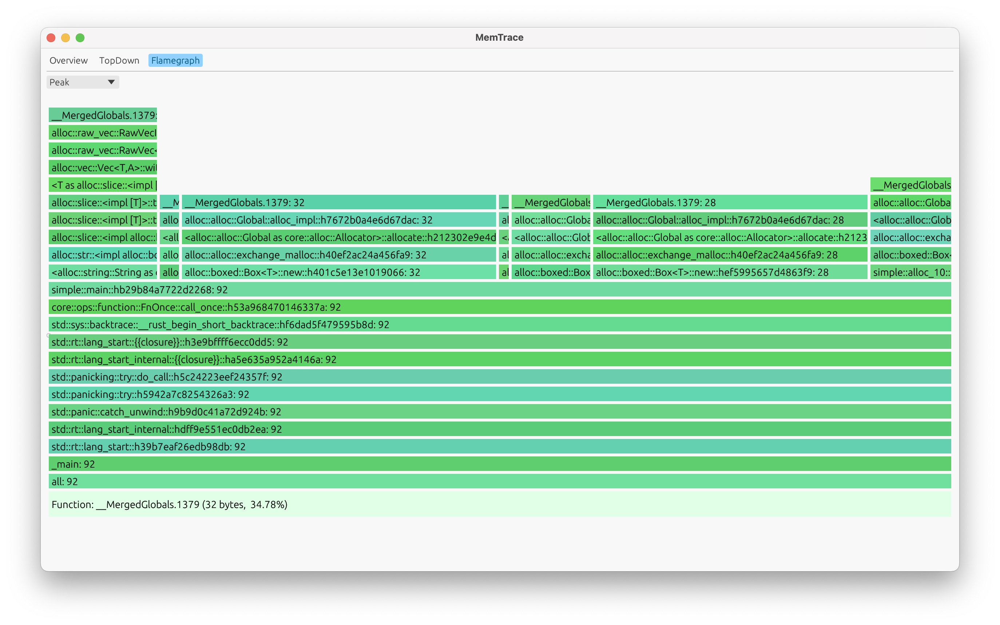

# memtrace-ui

## MemTrace UI

A GUI Rust-based tool for visualizing heap memory consumption inspired by [heaptrack](https://github.com/KDE/heaptrack). MemTrace supports heaptrack trace files, so you can read the samples built on Linux

The tool is using the [egui](https://github.com/emilk/egui) crate for building UI

> ℹ️ **Info:** So far, the tool works only on MacOS.

> ⚠️ **Warning:** At the moment, this tool requires downloading a dynamic library to function. The library is open source and can be found [here](https://github.com/blkmlk/memtrace-lib).

### Supported features:

### 1. Overview:

### 2. TopDown tree with source code:

### 3. Flamegraph:

