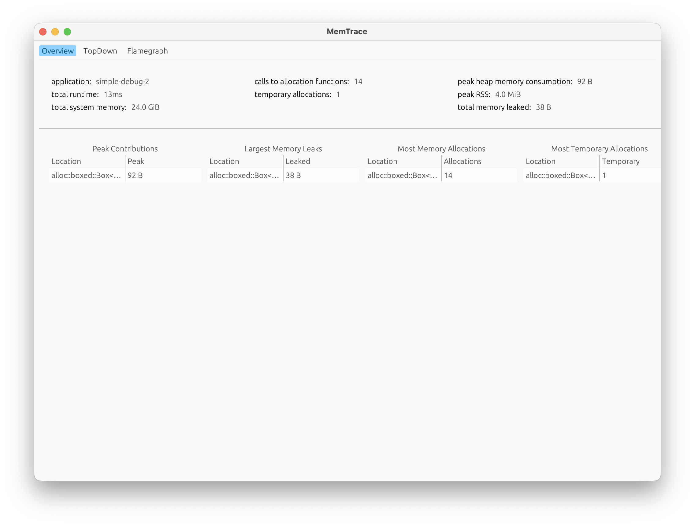

# memgraph-ui

## MemTrace UI

A GUI Rust-based tool for visualizing heap memory consumption inspired by [heaptrack](https://github.com/KDE/heaptrack)

The tool is using the [egui](https://github.com/emilk/egui) crate for building UI

Supported features:

### 1. Overview page:

### 2. TopDown page with source code:

### 3. Flamegraph page:

